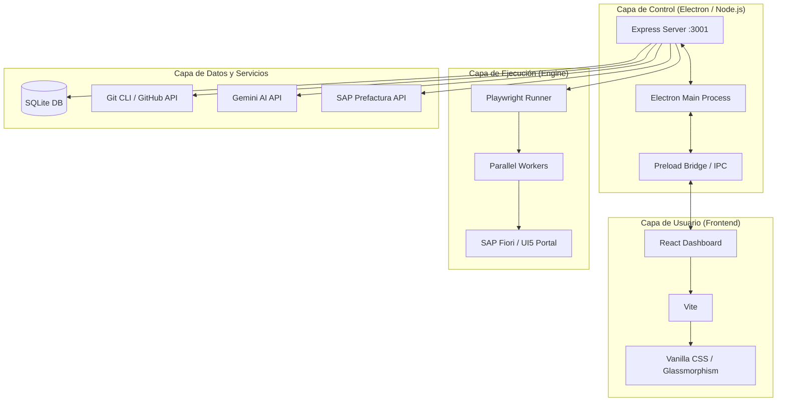

# 🌌 Guía Maestra: El Universo AutoBotIA
### El Orquestador Definitivo de Pruebas Automatizadas · Seidor AI Vision

Bienvenido a la documentación oficial de **AutoBotIA**. Este documento no es solo un manual técnico; es el mapa estelar de una herramienta diseñada para revolucionar el QA en ecosistemas SAP BTP, fusionando la potencia de Playwright con la inteligencia de Gemini AI.

---

## 🧭 Misión del Proyecto
Nuestra misión es simple pero ambiciosa: **Eliminar la fricción entre el tester y el código.** AutoBotIA permite que cualquier miembro del equipo, sin importar su nivel técnico, pueda ejecutar, grabar y analizar pruebas complejas con la precisión de un experto y la velocidad de la IA.

---

## 📜 Las Crónicas del Origen: La Evolución
AutoBotIA no nació siendo un gigante; fue forjado a través de iteraciones constantes de aprendizaje y feedback.

| Fase | Título | Hitos Clave |
| :--- | :--- | :--- |
| **v1.0.0** | **The Birth** | Integración inicial de Playwright Codegen y el primer motor de "IA Vision" con Gemini. |
| **v1.5.0** | **Visual Refinement** | Introducción de la estética *Glassmorphism* y el dashboard centralizado de escenarios. |
| **v2.0.0** | **The Sync Era** | Detección inteligente de proyectos, integración con GitHub PAT Tokens y notificaciones nativas. |
| **v2.1.0** | **Git-First Mastery** | Lanzamiento de la arquitectura "Git-First" con Splash Screen, auto-pull y empaquetado nativo (.dmg). |

---

## 🏗️ El Plano del Maestro: Arquitectura Técnica
AutoBotIA está construido sobre una pila tecnológica moderna y robusta, diseñada para ser extensible y de alto rendimiento.

### Vista de Águila (Ecosistema)

### Componentes Clave
1.  **El Rostro (UI/UX)**: Una Single Page Application (SPA) en React que utiliza un sistema de diseño propio basado en transparencias y micro-animaciones para una experiencia premium.
2.  **El Corazón (Backend Express)**: Un servidor interno que orquesta las llamadas al sistema, gestiona la base de datos SQLite y controla los procesos de Playwright.
3.  **El Motor (Playwright)**: El músculo que ejecuta los scripts de prueba. Soporta ejecución en paralelo, capturas de pantalla automáticas y grabaciones de video.
4.  **La Visión (Gemini AI)**: El motor de diagnóstico. Analiza por qué falló una prueba leyendo el DOM y comparando capturas de pantalla, entregando reportes humanos en segundos.

---

## 🚀 La Odisea del Tester: Funcionalidades Core

### 🌿 Misión 1: Onboarding Git-First
Al iniciar, AutoBotIA te recibe con un **Splash Screen inteligente**.
- **Detección Automática**: Encuentra el repositorio Git local.
- **Sincronización Total**: Al elegir una rama, el sistema realiza un `checkout` y `pull` automático, asegurando que siempre tengas los últimos escenarios de tus compañeros.
- **Seguridad**: Gestión centralizada de Tokens de Acceso Personal (PAT) para repositorios privados.

### ⚔️ Misión 2: El Coliseo de Ejecución
Ejecutar pruebas es tan simple como presionar un botón, pero detrás hay una orquestación compleja:
- **Reserva de Pre-Facturas**: El sistema llama automáticamente al API de SAP para reservar IDs de pre-factura antes de iniciar, evitando colisiones en ejecuciones paralelas.
- **Baterías en Paralelo**: Puedes ejecutar múltiples hilos (workers) simultáneamente, reduciendo el tiempo de regresión de horas a minutos.
- **Monitoreo Live**: Logs en tiempo real vía Server-Sent Events (SSE) que te muestran exactamente qué está pasando en cada worker.

### 🎥 Misión 3: La Cámara del Creador (Recorder)
¿Necesitas un flujo nuevo? AutoBotIA integra **Playwright Codegen** refinado:
1.  Presionas "Grabar".
2.  Interactúas con el portal SAP.
3.  AutoBotIA limpia el código generado, le añade validaciones de negocio y lo guarda directamente en el repositorio.

---

## 🛡️ Los Guardianes del Sistema: Validaciones y Seguridad
Para garantizar la estabilidad "Enterprise", el sistema implementa múltiples capas de protección:

> [!IMPORTANT]
> **Aislamiento de Evidencias**: Cada ejecución genera una carpeta única con timestamp, evitando que los resultados de un test se mezclen con otros.

- **Limpieza de Zombies**: Al cerrar la App, se ejecutan comandos de limpieza profunda para matar cualquier proceso de Playwright que haya quedado huérfano.
- **Validación de Credenciales**: El sistema verifica la validez del Git Token y la conectividad con SAP antes de permitir el inicio de una batería de pruebas.
- **Modo Silencioso**: Manejo de errores que previene "pantallazos rojos", ofreciendo sugerencias de solución en lugar de solo códigos de error.

---

## 🔭 Horizontes Lejanos: El Futuro de AutoBotIA
El camino no termina aquí. Estas son las tierras que planeamos conquistar:

1.  **Auto-Sanación de Selectores**: IA que detecta si un botón cambió de ID y sugiere el nuevo selector automáticamente.
2.  **Dashboard BI**: Analítica avanzada de tiempos de respuesta y estabilidad de ambientes SAP a lo largo del tiempo.
3.  **Multi-Cloud nativo**: Ejecución de baterías en contenedores Docker remotos para escalabilidad infinita.
4.  **IA Predictiva**: Sugerencia de escenarios de prueba basados en los cambios detectados en el código de SAP.

---

## 🤝 El Consejo de Seidor
Este proyecto es el resultado de la pasión por la excelencia técnica y la innovación constante.

- **Arquitecto Líder**: Pierre Gálvez.
- **Soporte Técnico**: Equipo Seidor AI Vision / QA Automation.
- **Tecnologías**: Electron, React, Node.js, Playwright, SQLite, Gemini AI.

> [!TIP]
> Si encuentras un "glitch" en el sistema o tienes una idea para una nueva "habilidad", contacta con el equipo de arquitectura. ¡Tu feedback es nuestro combustible!

---

Hecho con 💜 por el equipo de Innovación de Seidor · 2026

