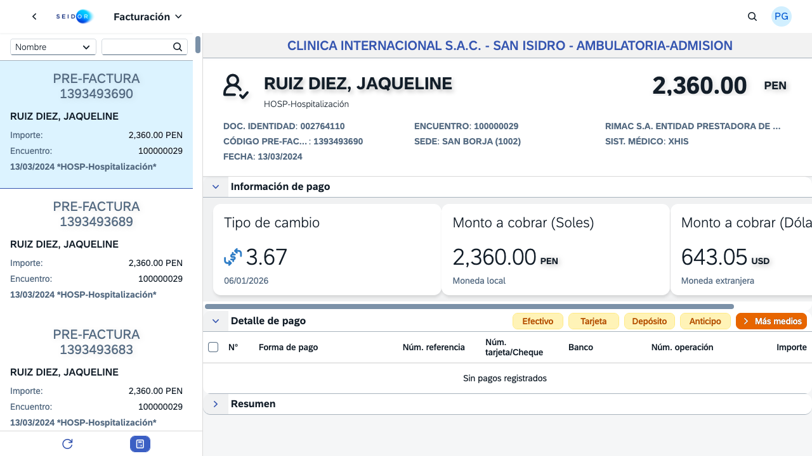
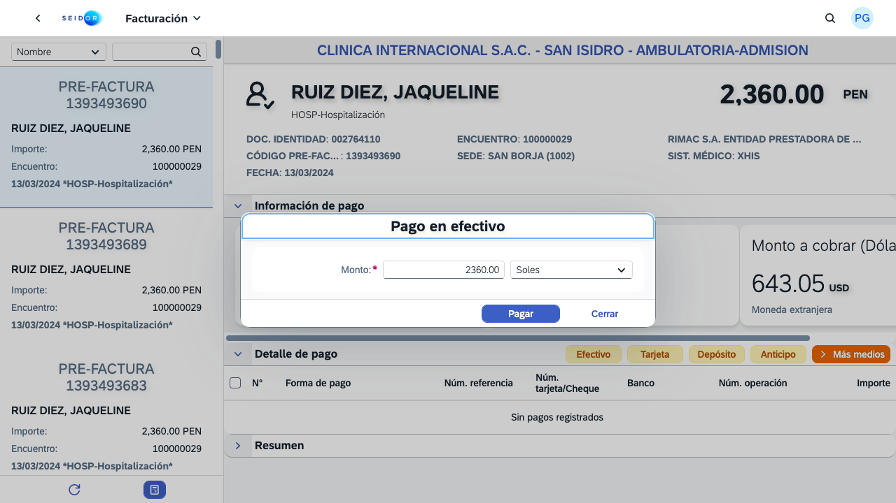
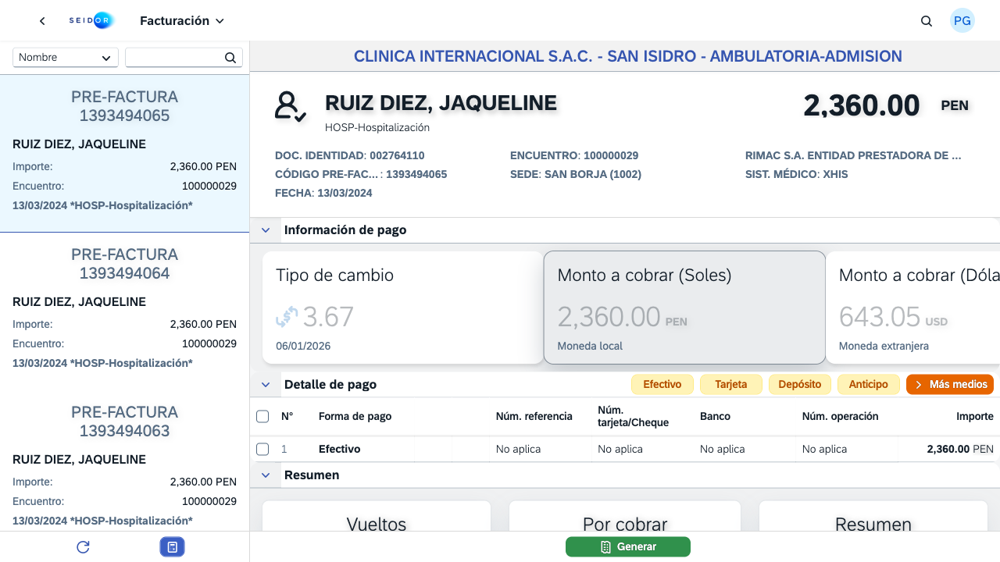
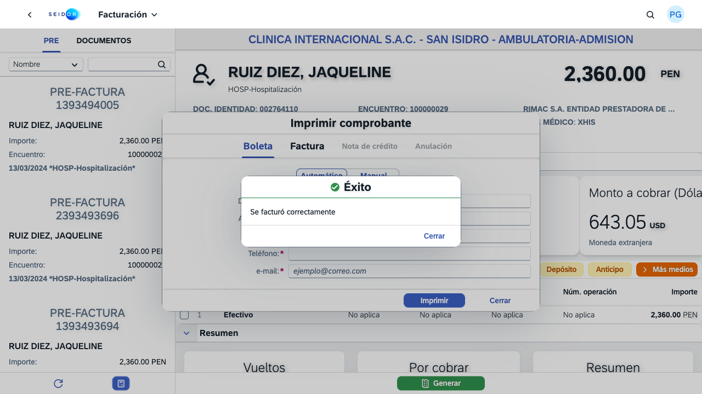

# Informe de Prueba — Caso 1: Boleta Efectivo

**Cliente:** Clínica Internacional (CI) | **Ambiente:** QAS | **Tester:** PGALVEZ3  
**Fecha:** 2026-02-27 | **Hora inicio:** 16:19 PET | **Duración total:** 36.50s

---

## ✅ Resultado: EXITOSO

| Paso | Descripción                          | Estado | Tiempo |
| ---- | ------------------------------------ | ------ | ------ |
| 1    | Login al portal SAP Fiori            | ✅ ok  | ~5s    |
| 2    | Abrir app Facturación                | ✅ ok  | ~6s    |
| 3    | Seleccionar Pre-factura `1393493686` | ✅ ok  | ~3s    |
| 4    | Cobro en Efectivo (S/. 2,360.00)     | ✅ ok  | ~5s    |
| 5    | Generar Boleta + Imprimir            | ✅ ok  | ~10s   |
| 6    | Verificar en tab DOCUMENTOS          | ✅ ok  | ~3s    |

**Pre-factura ID:** `1393493686`  
**Paciente:** RUIZ DIEZ, JAQUELINE  
**Monto cobrado:** S/. 2,360.00 PEN (Efectivo)  
**Encuentro:** 100000029  
**Sede:** SAN BORJA (1002)

---

## 📸 Evidencia Fotográfica

### 1. Antes del cobro — detalle de pre-factura cargado

### 2. Modal de pago en efectivo

### 3. Post-pago — fila Efectivo registrada en tabla

### 4. Comprobante emitido — tab DOCUMENTOS

---

## ℹ️ Notas

- La impresora física no está conectada en QAS (error esperado: "No hay conexión con la impresora") — la boleta **sí se emite** en el sistema.
- El flujo completo es 100% automatizado, cero intervención manual.
- Evidencia guardada en: `evidence/`

---

_Generado automáticamente por Antigravity — Set de Pruebas Seidor_
